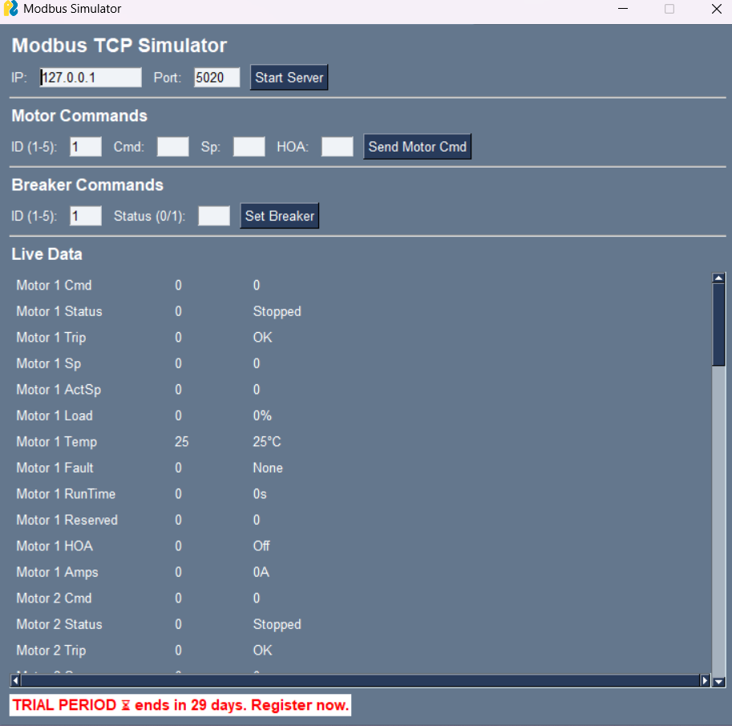
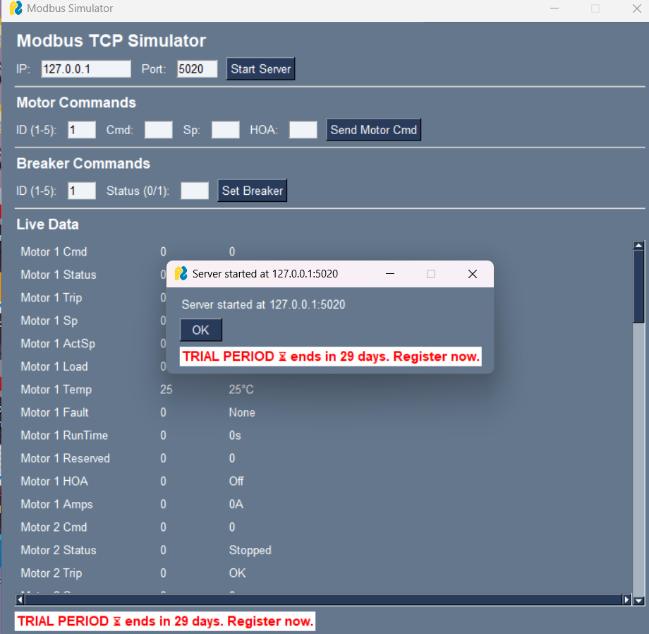
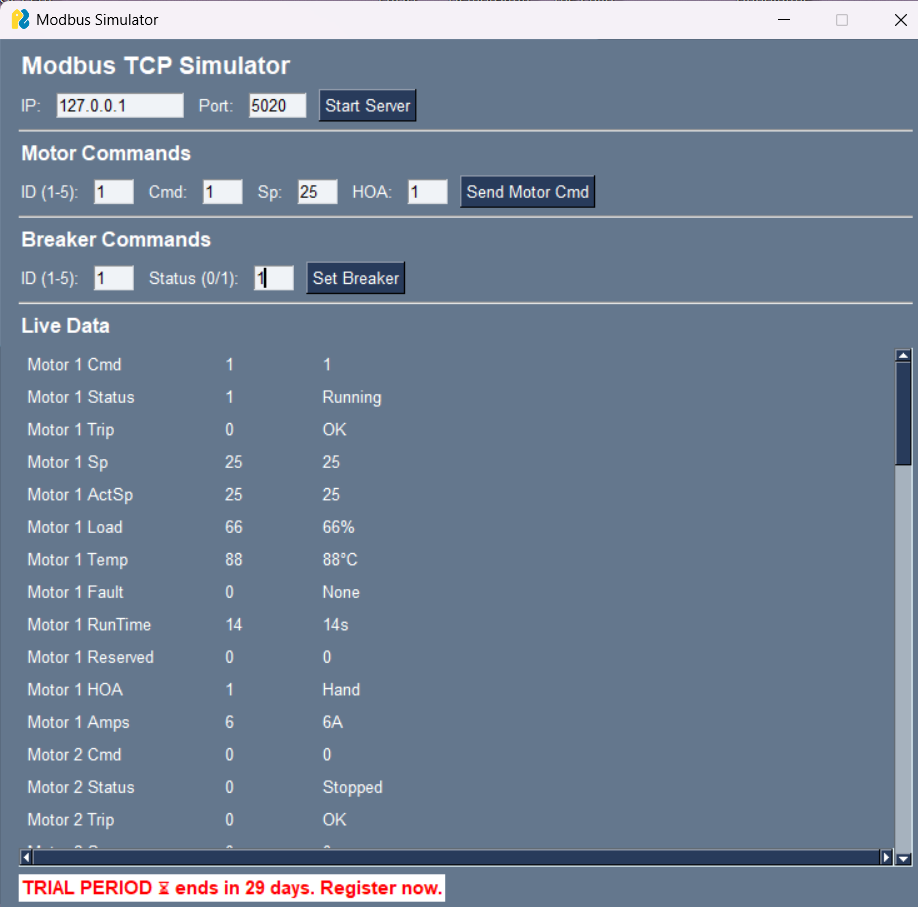

# Ignition-Modbus-lab

An educational Python-based Modbus TCP simulator designed for hobbyists, automation enthusiasts, and SCADA learners aiming to explore Ignition's Modbus integration capabilities. This interactive project provides a hands-on environment to test and understand how Modbus registers map into Ignition SCADA systems.

The simulator, built using `PySimpleGUI` and `pymodbus`, includes dynamic data generation for motors and switchgear breakers, allowing learners to simulate realistic device behaviors, send commands, and visualize updates in real-time.

---

## Modbus Simulator

This Python-based Modbus TCP simulator is designed to emulate motor control and switchgear devices for testing SCADA systems like Ignition. It uses `pymodbus` and `PySimpleGUI` to provide a live, interactive interface where users can view and command Modbus data in real time.

### Features:
- Start a Modbus TCP server at any IP/port (default: `127.0.0.1:5020`)
- Command motors using `Cmd`, `Setpoint (Sp)`, and `HOA` inputs
- Toggle breaker status (On/Off)
- Live data updates for:
  - Motor status, trip, speed, load, temperature, amps, runtime
  - Breaker trip count, voltage, current

### How it works:
Once you start the simulator, the GUI allows you to:
1. Launch the Modbus server.
2. Send motor commands and observe changes in real-time data.
3. Set breaker states (1 or 0).
4. Monitor all values updated periodically in the interface.

### Screenshots

**1. Initial launch**

**2. Server started**

**3. Live motor and breaker updates after command**

This screenshot shows real-time updates after sending a motor command:
- The motor transitions to **Running**, with speed, load, and temperature values reflecting active behavior.
- The **breaker status** and electrical parameters (trip count, voltage, current) also update periodically to simulate live field conditions.

