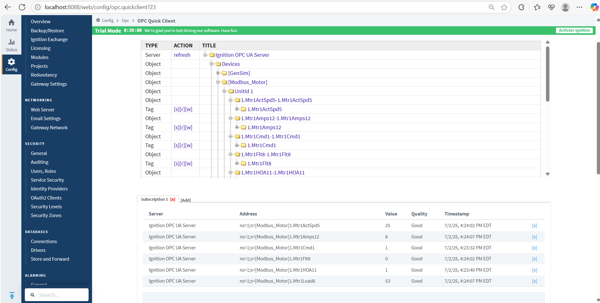
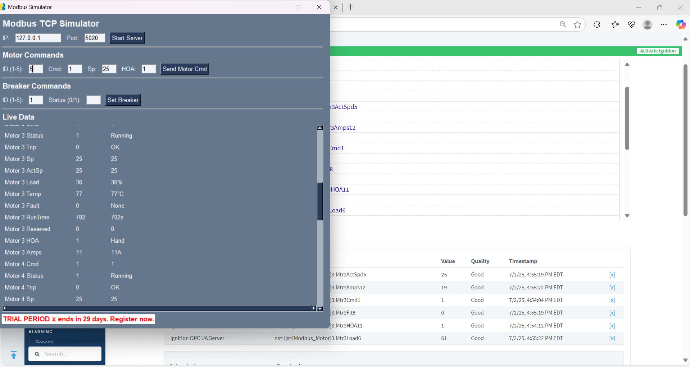
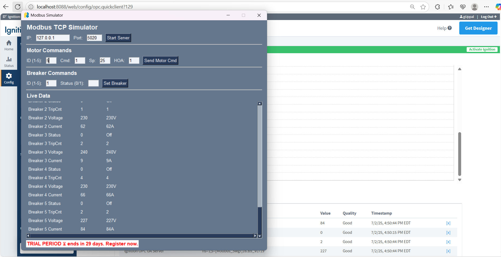
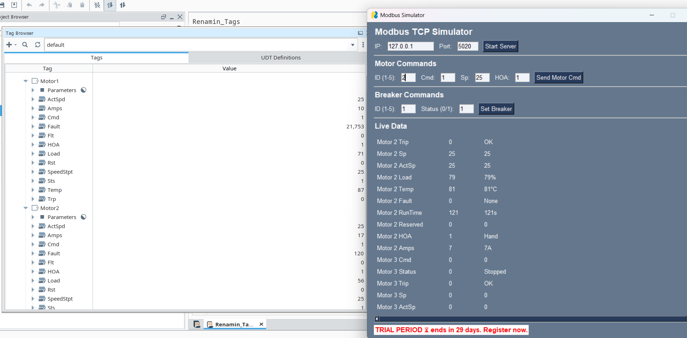
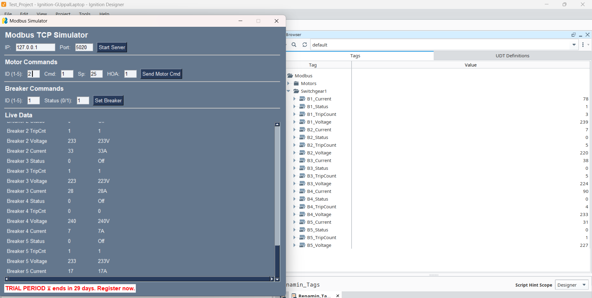
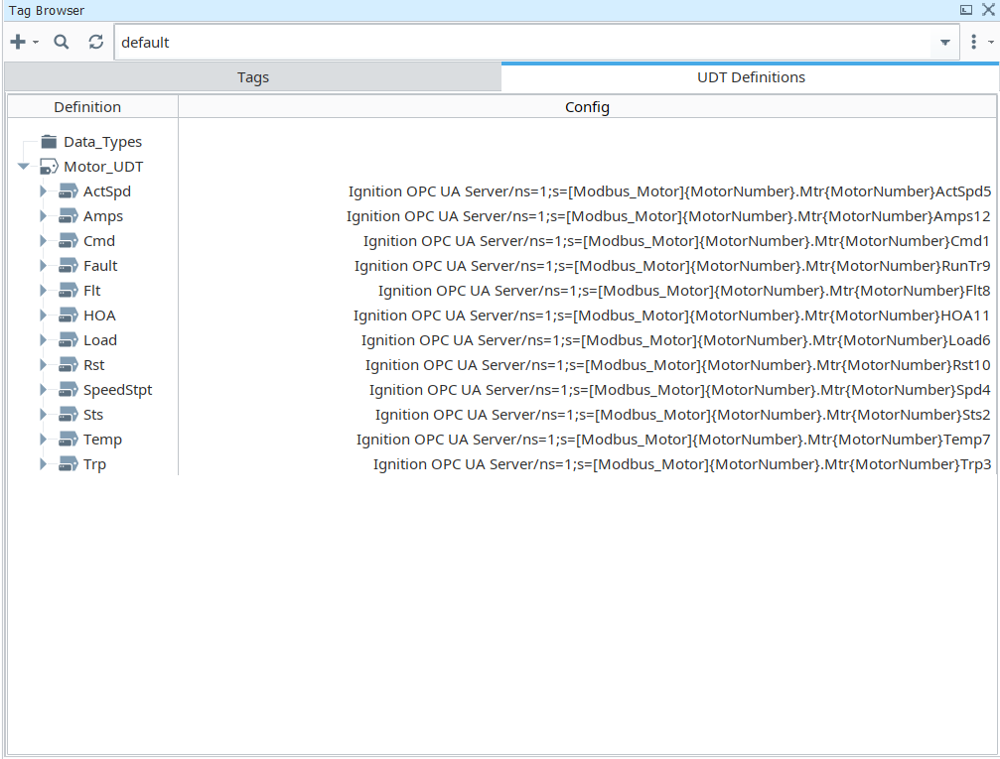

# Ignition-Modbus-lab

An educational Python-based Modbus TCP simulator designed for hobbyists, automation enthusiasts, and SCADA learners aiming to explore Ignition's Modbus integration capabilities. This interactive project provides a hands-on environment to test and understand how Modbus registers map into Ignition SCADA systems.

The simulator, built using `PySimpleGUI` and `pymodbus`, includes dynamic data generation for motors and switchgear breakers, allowing learners to simulate realistic device behaviors, send commands, and visualize updates in real-time.

---

## Modbus Simulator

This Python-based Modbus TCP simulator is designed to emulate motor control and switchgear devices for testing SCADA systems like Ignition. It uses `pymodbus` and `PySimpleGUI` to provide a live, interactive interface where users can view and command Modbus data in real time.

### Features:
- Start a Modbus TCP server at any IP/port (default: `127.0.0.1:5020`)
- Command motors using `Cmd`, `Setpoint (Sp)`, and `HOA` inputs
- Toggle breaker status (On/Off)
- Live data updates for:
  - Motor status, trip, speed, load, temperature, amps, runtime
  - Breaker trip count, voltage, current

### How it works:
Once you start the simulator, the GUI allows you to:
1. Launch the Modbus server.
2. Send motor commands and observe changes in real-time data.
3. Set breaker states (1 or 0).
4. Monitor all values updated periodically in the interface.

### Screenshots

### 🧪 Modbus Simulator Interface

  
  
  

These screenshots demonstrate the simulator in action:

- The TCP Modbus server is successfully launched and listening on the specified IP and port.
- After issuing a motor **command** (Cmd = 1, HOA = 1 or 2), the motor transitions to **Running**.
- Live updates are visible for:
  - Motor parameters like speed setpoint (Sp), actual speed (ActSp), load, temperature, and runtime.
  - Breaker electrical readings like **Status**, **Trip Count**, **Voltage**, and **Current**.
- GUI refreshes at 1-second intervals, simulating realistic Modbus traffic.

🔗 [View Simulator Source Code](modbus-simulator/Modbus_simulator.py)

## 🔌 Ignition Integration

This section showcases how the Modbus simulator integrates with Ignition using OPC UA.

### 🔧 Motor & Breaker Tags in Ignition

The simulator publishes motor and breaker data which is imported into Ignition using Modbus mapping. These tags are displayed in the OPC browser and update in real-time.

### 📸 Screenshots

  
  
  

These screenshots show:

- OPC tag browser view with mapped Modbus addresses.
- Real-time values for motor commands, status, and process variables.
- Breaker electrical data including voltage, current, and trip count.

## 📂 Modbus Maps and Ignition Import

You can explore or download the Modbus register maps and corresponding Ignition import files directly from this repository:

- 🗂️ **Modbus Mapping CSVs** (used to configure the simulator):
  - [`Modbus_Motor_Map.csv`](modbus-maps/Modbus_Motor_Map.csv)
  - [`Modbus_Switchgear_Map.csv`](modbus-maps/Modbus_Switchgear_Map.csv)

- 📥 **Ignition Import-Ready CSVs**  
  (used to import tags through the **Ignition Gateway**):
  - [`Ignition-import-motors.csv`](modbus-maps/Ignition-import-motors.csv)
  - [`Ignition_Import_Switchgear_Breaker.csv`](modbus-maps/Ignition_Import_Switchgear_Breaker.csv)

> 📝 **Note:**  
> The Modbus map for the switchgear uses a **hexadecimal addressing scheme**, which is common in industrial PLC documentation.  
> However, **Ignition requires addresses in decimal format**, so make sure to convert all hexadecimal values to decimal before using them in Ignition.

## 🛠️ Ignition Designer Configuration

The Ignition Designer is used to visualize and configure the imported Modbus tags for both motors and switchgear devices.

These screenshots illustrate how the simulator data is brought to life within the Ignition Designer:

  
  
  

### Key Highlights:

- **Tag Hierarchy**: Motors and breakers are organized into folders for structured access.
- **Live Data Visualization**: Real-time values from the simulator are bound to components like labels and indicators.
- **UDT Implementation**: Motors and breakers are created as User Defined Types (UDTs) to standardize tag structures and simplify scaling.

These design elements help test Modbus tag behavior in a visual, scalable way inside Ignition.

